# 基于yolo的目标检测（海康算子使用Blob分析）使用文档
## 2. 环境配置
1. 支持的操作系统：Windows10/11 X64
**此项目只支持在Nvidia显卡上运行。**
1. 运行时依赖 ：此项目需要使用cuda,因此需要安装cuda toolkit以及cuDNN。
   1. 显卡驱动下载：若电脑在此前从未安装过相应的驱动，需先安装显卡驱动，英伟达显卡驱动[下载连接](https://www.nvidia.com/en-us/software/nvidia-app/)。
   2. cuda工具包下载：在安装前现在命令台输入("nvidia-smi.exe")查询**最高支持**的cuda version（就只是最高而已，不需要一定下载这个，强烈建议就只下载cuda11.7），如图所示：
   
   在cuda工具包[下载链接](https://nbai-cloud-3-0.oss-ap-southeast-1.aliyuncs.com/yolo-sdk/dependencies/cuda_11.7.1_516.94_windows.exe)下载后安装。(如果是win10的电脑需从官网下载，[下载链接](https://developer.nvidia.com/cuda-11-7-1-download-archive?target_os=Windows&target_arch=x86_64&target_version=10&target_type=exe_local))
   3. cuDNN下载：[下载链接](https://nbai-cloud-3-0.oss-ap-southeast-1.aliyuncs.com/yolo-sdk/dependencies/cudnn-windows-x86_64-8.5.0.96_cuda11-archive.zip)下载完成后解压
   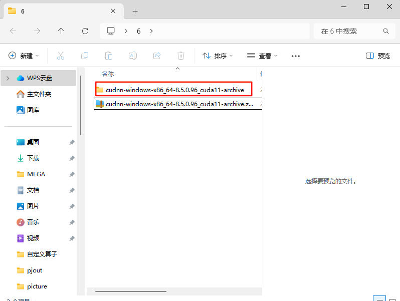
   进入解压完的文件夹，**复制**"bin"、"include"、"lib"这三个文件夹
   
   打开“C:\Program Files\NVIDIA GPU Computing Toolkit\CUDA”里面有你安装的对应的cuda工具包版本，再打开这个文件夹。
   
   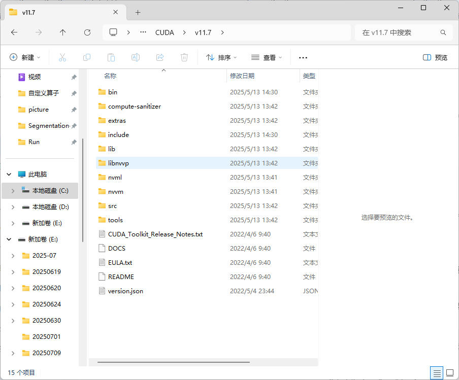
   将cuDNN中复制的三个文件夹粘贴进此文件夹。粘贴完后进入"bin"中应该可以看到里面包含cudnn
   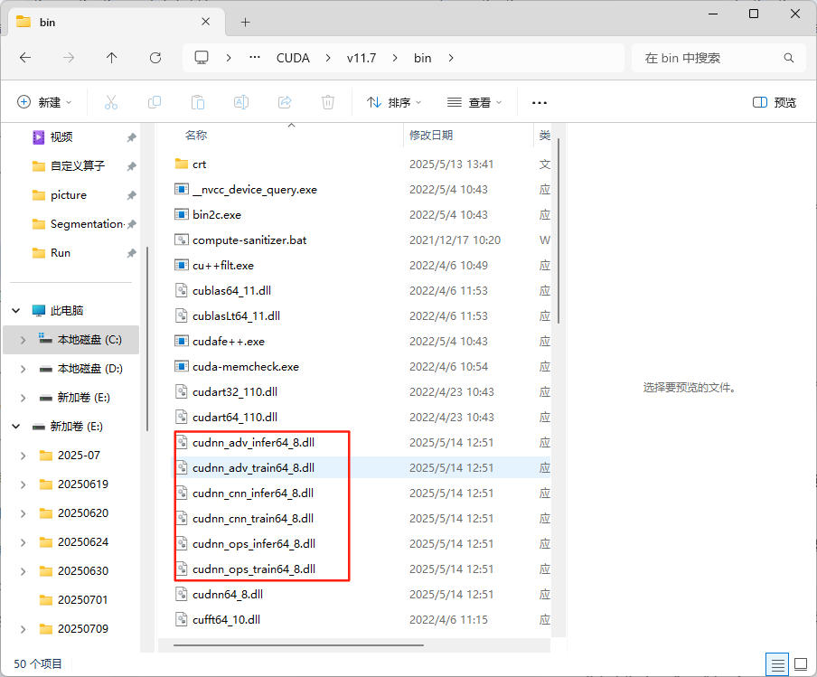
   
1. [下载链接](https://nbai-cloud-3-0.oss-ap-southeast-1.aliyuncs.com/yolo-sdk/dependencies/PublicFile.rar),下载此"PublicFile"文件，解压后打开此"PublicFile"文件夹如下图所示
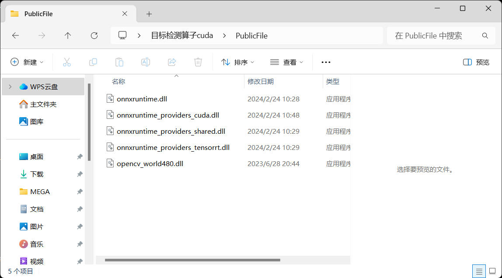
复制里面的内容，粘贴进“C盘”-"Program Files"-"VisionMaster4.2.0"-"Applications"-"PublicFile"-"x64"中

2. 复制此文档所在文件夹中的"YOLO_Det"和"image_split",粘贴进“C盘”-"Program Files"-"VisionMaster4.2.0"-"Applications"-"Module(sp)"-"x64"-"Collection"中。
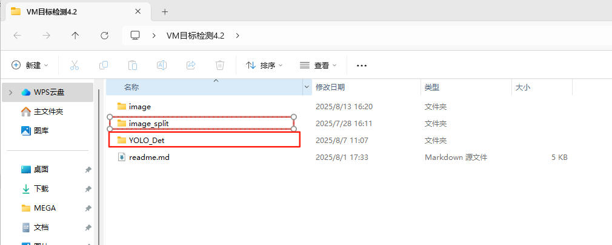
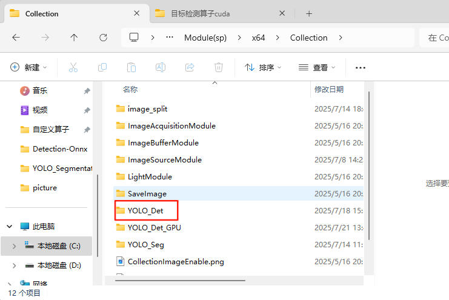

## 3. 快速入门
下面给出一个示例，帮助您快速了解如何使用此项目完成C++软件开发。本示例使用VS2022版本给出示例。

1. 打开"visionMaster"软件-"通用方案"

2. 1. 点击"采集"-"图像源"，将其拖出至中间
   
   2. 双击"0图像源1",将像素格式修改为"RGB24"
   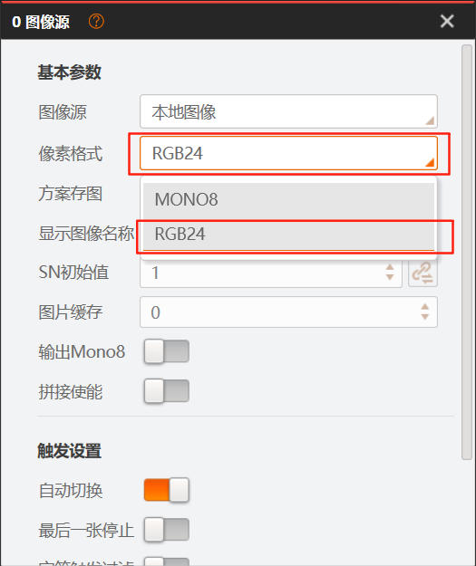
3. 1. 点击"逻辑工具"-"格式化"，拖出**两个**
   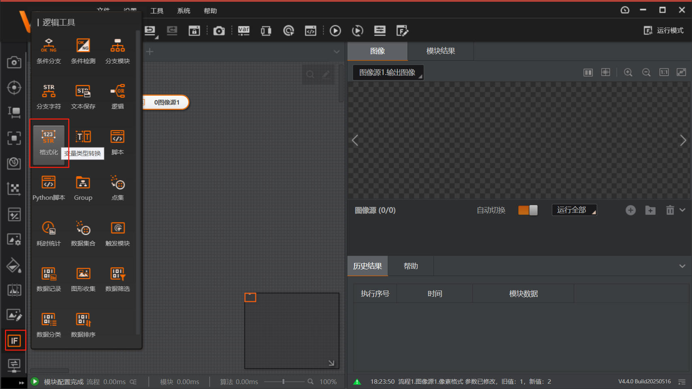
   
   2. 双击"1格式化1"，点击"添加"，“T”，在下面的行中输入“标签路径”（names.txt所在路径，names.txt需要使用utf-8保存），然后点击右下角“保存”
   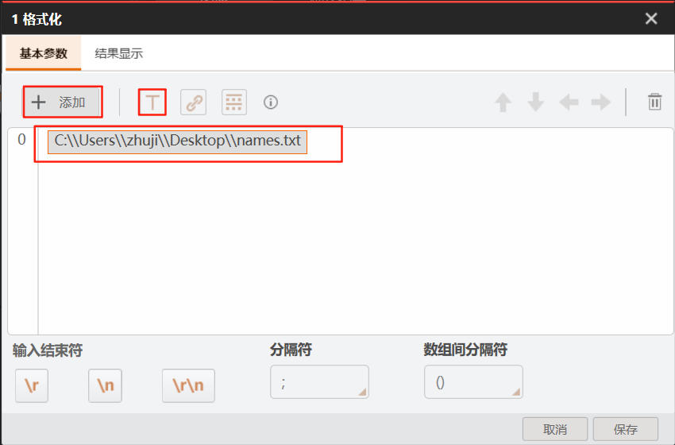
   3. 双击"2格式化2"，点击"添加"，“T”，在下面的行中输入“模型路径”，然后点击右下角保存
   
4. 1. 点击“采集”-“YOLO_Det”,将其拖出，按照如图所示连接
   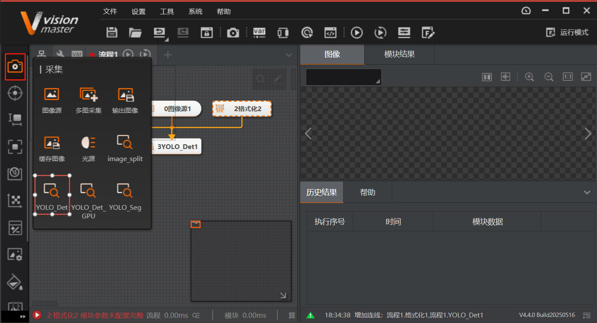
   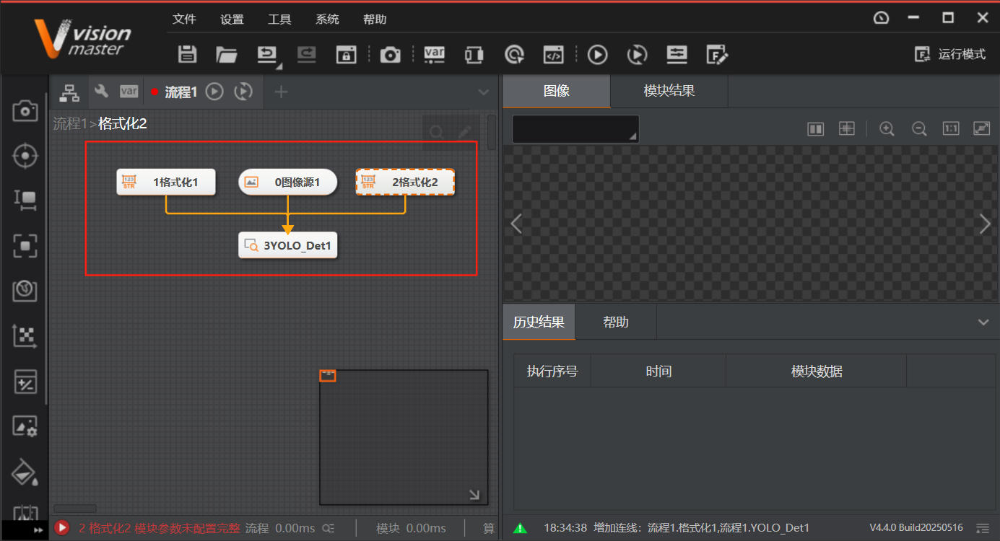
   2. 按下图所示，点击"运行参数" -"标签路径最右侧的按钮"-"链接标志的按钮"-"1格式化1"-"格式化结果"
   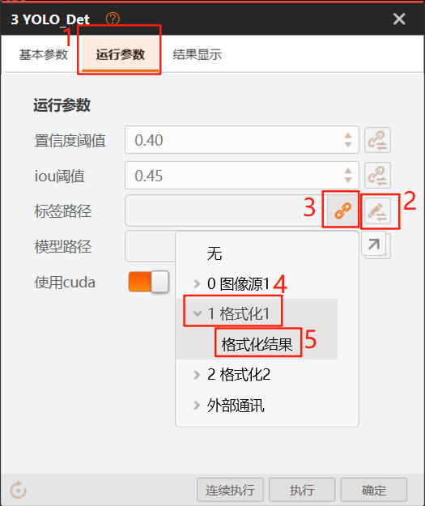
   3. 同理，点击"模型路径最右侧的按钮"-"链接标志的按钮"-"2格式化2"-"格式化结果"
   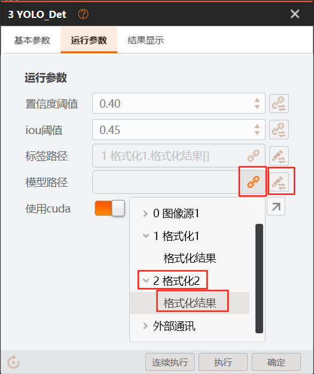
   4. 如果不使用cuda，则将"使用cuda"的选项给关闭
   5. 点击右下角的"确定"
5. 1. 如图将两份image_split放置在图中，再拖出一个Blob标签分析，与5image_split相连接。
   
   2. 将5image_split中的选项如图所示，
   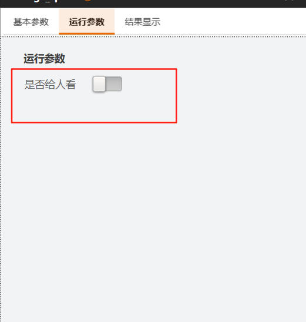
   3. 4image_split中则是打开。
6. Blob分析中，采用双阈值，所以如果想要寻找names.txt中的第一类，只需将低阈值和高阈值都选为1。
   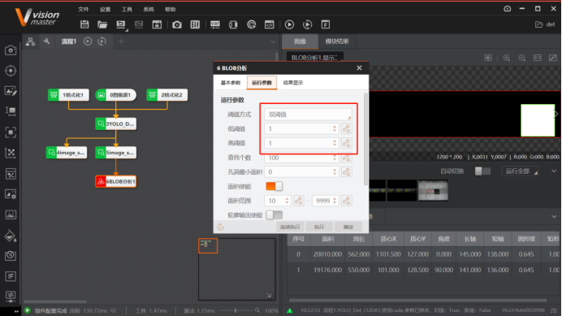